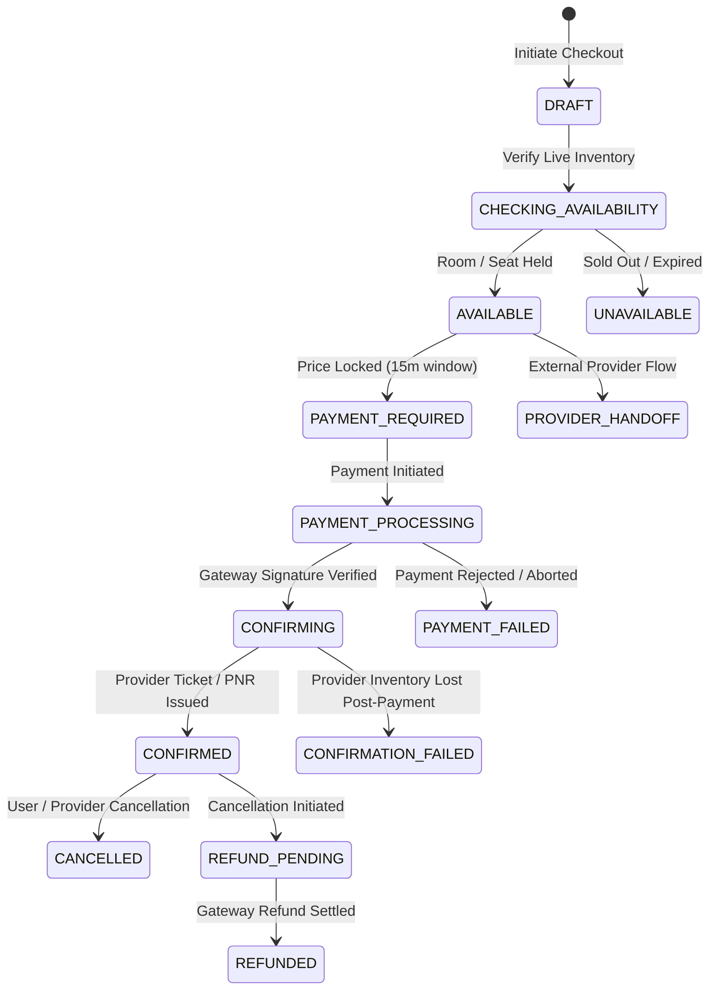

# VANVAS Real Transactions, Booking & Execution Architecture

**Phase 3 Technical & Operational Specification**  
*Authoritative Booking Lifecycle, Provider Abstraction, Payment Derivation, and Trip Workspace Integration*

---

## 1. Executive Summary & Non-Negotiable Truth Model

VANVAS operates as a **live Himalayan and mountain travel operating system**. In accordance with Phase 3 principles, VANVAS strictly enforces the following rules:

1. **Zero Fake Confirmations**: VANVAS never displays a "Booking Confirmed" state unless a durable, authoritative record is persisted in the database and validated by the backend/provider.
2. **Exhaustive Status Distinction**: Every item strictly distinguishes between:
   - `LIVE`
   - `CONFIRMED`
   - `PENDING`
   - `ESTIMATED`
   - `CURATED`
   - `PROVIDER_HANDOFF`
   - `UNAVAILABLE`
   - `FAILED`
   - `CANCELLED`
   - `REFUNDED`
   - `UNKNOWN`
3. **Fail-Closed Production Boundary**: If an external live provider (Amadeus, StayingAPI, IRCTC) lacks production credentials, VANVAS fails closed or honestly exposes `PROVIDER_HANDOFF`, never silently faking a live transaction.
4. **Server-Side Financial Derivation**: Clients never specify the payable amount. The backend independently calculates base tariffs, GST (12% standard stay slab), service fees, and cancellation penalties from verified provider pricing and immutable snapshots.

---

## 2. Booking Domain & Schema

A durable booking record is keyed by both an internal UUID `id` and a unique, user-facing reference code formatted as `VV-2026-XXXXXXXX` (e.g. `VV-2026-A1B2C3D4`).

### Relational Schema (`bookings` table)

| Column | Type | Description |
| :--- | :--- | :--- |
| `id` | `VARCHAR(36)` | Primary Key UUID |
| `public_booking_reference` | `VARCHAR(32)` | Durable unique reference (e.g. `VV-2026-XXXX`) |
| `user_id` | `VARCHAR(36)` | Foreign key to `users.id` (Indexed) |
| `trip_id` | `VARCHAR(36)` | Optional Foreign key to `trips.id` (Indexed) |
| `booking_type` | `VARCHAR(32)` | `stay`, `hotel`, `hostel`, `homestay`, `rental`, `bus`, `train`, `flight`, `cab`, `activity` |
| `provider` | `VARCHAR(64)` | `vanvas_sandbox_stay_adapter`, `amadeus`, `stayingapi`, `irctc`, `redbus` |
| `provider_booking_reference` | `VARCHAR(128)` | External confirmation code from provider |
| `status` | `VARCHAR(32)` | Booking state machine status (Indexed) |
| `payment_status` | `VARCHAR(32)` | `payment_required`, `payment_pending`, `payment_success`, `payment_failed`, `refund_pending`, `refund_complete` |
| `currency` | `VARCHAR(8)` | Default `INR` |
| `base_amount` | `FLOAT` | Authoritative base rate |
| `taxes` | `FLOAT` | GST breakdown |
| `fees` | `FLOAT` | Processing fees / platform tariff |
| `total_amount` | `FLOAT` | Final aggregate amount payable |
| `cancellation_amount` | `FLOAT` | Amount refundable / retained upon cancellation |
| `refundable` | `BOOLEAN` | Whether cancellation terms permit refund |
| `booking_snapshot` | `JSON` | Immutable historical snapshot of property, dates, guest details, and pricing at checkout |
| `idempotency_key` | `VARCHAR(128)` | Unique key preventing duplicate taps / network retries (Indexed) |
| `metadata` | `JSON` | Special requests, guest documents, flight/train numbers |
| `created_at` | `DATETIME` | Timestamp UTC |
| `updated_at` | `DATETIME` | Timestamp UTC |
| `confirmed_at` | `DATETIME` | Authoritative confirmation timestamp |
| `cancelled_at` | `DATETIME` | Cancellation timestamp |

---

## 3. Formal Booking State Machine

All state transitions are strictly validated and managed server-side. Direct client manipulation is rejected.



### Auditable Transition Rules
- `DRAFT` $\to$ `CHECKING_AVAILABILITY`
- `CHECKING_AVAILABILITY` $\to$ `AVAILABLE` | `UNAVAILABLE`
- `AVAILABLE` $\to$ `PAYMENT_REQUIRED` | `PROVIDER_HANDOFF`
- `PAYMENT_REQUIRED` $\to$ `PAYMENT_PROCESSING` | `CANCELLED`
- `PAYMENT_PROCESSING` $\to$ `CONFIRMING` | `PAYMENT_FAILED`
- `CONFIRMING` $\to$ `CONFIRMED` | `CONFIRMATION_FAILED`
- `CONFIRMED` $\to$ `CANCELLED` | `REFUND_PENDING`
- `REFUND_PENDING` $\to$ `REFUNDED`

---

## 4. Payment & Idempotency Architecture

### Amount Derivation
- Clients submit `{ offer_id, start_date, end_date, guests, rooms, idempotency_key }`.
- Backend looks up the authoritative offer, revalidates rates with the provider adapter, computes GST ($12\%$) and total amount, and creates a pre-authorized record.
- Any discrepancy between client display and server calculation results in explicit revalidation prompt rather than silent adjustment.

### Idempotency Flow
Every transaction endpoint (`/checkout`, `/{id}/pay`, `/{id}/verify-payment`, `/{id}/cancel`) accepts an `idempotency_key`.
- If an existing transaction with the same key is detected, the server returns the cached authoritative response without executing duplicate charges or duplicate bookings.
- Consecutive taps on mobile or web are debounced client-side and secured server-side.

### Safe Timeout Reconciliation
If a network timeout occurs during payment verification:
1. The frontend enters an indeterminate state: *"Checking your booking status..."*
2. The UI polls `GET /api/v1/bookings/{id}/reconcile` with backoff.
3. The server queries the payment gateway and provider to verify whether funds were captured.
4. The user is never presented with *"Payment Failed"* if the transaction status is unknown or pending at the gateway.

---

## 5. Provider Adapter Architecture

All provider integrations inherit from the canonical `BookingProvider` base interface:

```python
class BookingProvider(ABC):
    @abstractmethod
    async def search(self, params: SearchParams) -> List[Offer]: ...
    
    @abstractmethod
    async def availability(self, offer_id: str, dates: DateRange) -> AvailabilityResult: ...
    
    @abstractmethod
    async def pricing(self, offer_id: str, dates: DateRange, guests: int) -> PriceBreakdown: ...
    
    @abstractmethod
    async def create_booking(self, payload: BookingPayload) -> ProviderBookingResult: ...
    
    @abstractmethod
    async def retrieve_booking(self, provider_ref: str) -> BookingDetails: ...
    
    @abstractmethod
    async def cancel_booking(self, provider_ref: str, reason: str) -> CancellationResult: ...
    
    @abstractmethod
    async def refund_status(self, refund_id: str) -> RefundResult: ...
```

### Environment Isolation (`PROVIDER_ENV`)
- `PROVIDER_ENV=sandbox`: Uses deterministic `SandboxStayAdapter` with realistic Indian GST calculations, test confirmation codes, and instant mock refund cycles.
- `PROVIDER_ENV=production`: Requires valid credentials in environment (`AMADEUS_CLIENT_ID`, `RAZORPAY_KEY_ID`, `RAZORPAY_KEY_SECRET`). Fails closed with descriptive configuration error if missing.

---

## 6. Endpoints API Reference

| Method | Path | Description | Security |
| :--- | :--- | :--- | :--- |
| `POST` | `/api/v1/bookings/checkout` | Revalidates price, reserves inventory, creates durable draft | Auth required |
| `GET` | `/api/v1/bookings` | Lists user's transaction ledger with filters | Auth required |
| `GET` | `/api/v1/bookings/{id}` | Retrieves booking detail with snapshot | Auth required + Owner |
| `POST` | `/api/v1/bookings/{id}/pay` | Initiates gateway order with server-calculated amount | Auth required + Owner |
| `POST` | `/api/v1/bookings/{id}/verify-payment` | Verifies gateway signature and confirms booking | Auth required + Owner |
| `POST` | `/api/v1/bookings/{id}/cancel` | Executes cancellation policy and triggers refund | Auth required + Owner |
| `GET` | `/api/v1/bookings/{id}/reconcile` | Polls gateway/provider truth during network recovery | Auth required + Owner |
| `POST` | `/api/v1/bookings/{id}/attach-trip` | Links booking to an expedition workspace | Auth required + Owner |
| `GET` | `/api/v1/trips/{trip_id}/bookings` | Returns all authoritative bookings for a trip | Auth required + Member |
| `POST` | `/api/v1/bookings/webhooks/{provider}` | Idempotent webhook receiver with signature validation | HMAC Header |

---

## 7. Trip Workspace & Notification Integration

- **Dedicated Bookings Tab**: The trip detail workspace (`/trips/[id]`) features an authoritative **Bookings** tab showing committed spend, confirmed stays, transits, and external handoffs.
- **Itinerary Connecting**: Bookings link directly with the itinerary day/time (e.g. check-in timeline and departure cards).
- **Notifications**: Phase 2 notification engine dispatches alerts for:
  - *Booking Confirmed (Reference `VV-2026-XXXX`)*
  - *Payment Processing / Action Required*
  - *Cancellation & Refund Initiated*
  - Safe deep links navigate directly to `/bookings` or `/trips/{id}`.

---

## 8. Mobile Resilience (Android Capacitor & PWA)

- **State Preservation**: Checkout state and input drafts survive backgrounding, app kills, and network transitions.
- **Safe Area Insets**: Modal drawers respect dynamic top header offsets and bottom notch safe areas.
- **Idempotent Retries**: Offline and intermittent network reconnects query the server before re-submitting payments.

---

## 9. Production Activation Checklist

Before activating live transactions in production:
- [ ] Set `PROVIDER_ENV=production` in production environment.
- [ ] Configure `RAZORPAY_KEY_ID` and `RAZORPAY_KEY_SECRET`.
- [ ] Configure `RAZORPAY_WEBHOOK_SECRET` for webhook signature verification.
- [ ] Configure `AMADEUS_CLIENT_ID` and `AMADEUS_CLIENT_SECRET` for live GDS stays.
- [ ] Verify SSL termination and HTTPS redirect on all payment callback URLs.
- [ ] Run backend automated test suite: `pytest backend/tests`.
- [ ] Run frontend typecheck: `npx tsc --noEmit`.
- [ ] Verify zero secrets committed to Git repository.
