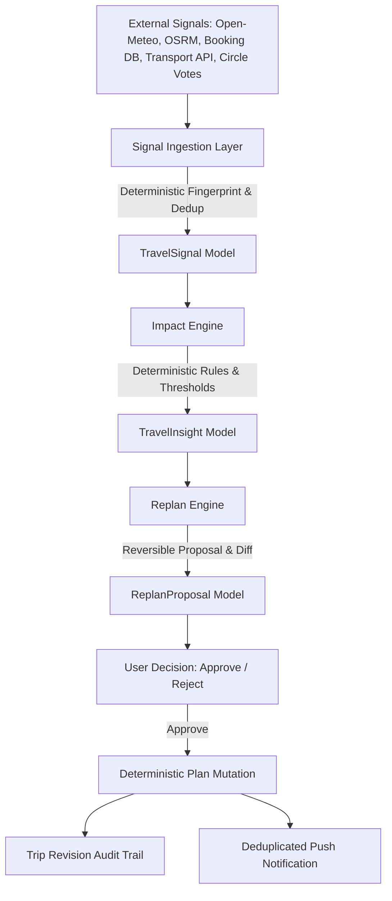

# VANVAS Proactive Travel Intelligence & Live Trip Operations (Phase 4)

## Overview & Product Philosophy

VANVAS is an authoritative travel operating system, not an AI notification center or decorative AI widget.

Every intelligence feature connects:
```
REAL TRIP STATE
  → EXTERNAL SIGNAL
  → DETECTION
  → IMPACT ANALYSIS
  → ACTIONABLE RECOMMENDATION
  → USER DECISION
  → VALIDATION
  → PERSISTENCE
  → ITINERARY / BUDGET / BOOKING UPDATE
  → NOTIFICATION
  → AUDIT TRAIL
```

---

## 1. Architecture



### Domain Models

1. **`TravelSignal`** (`travel_signals` table)
   - `id`: Unique UUID identifier.
   - `trip_id`: Associated trip identifier.
   - `signal_type`: Signal category (`WEATHER`, `TRANSPORT`, `ROAD_TRAFFIC`, `BOOKING`, `CHECK_IN`, `OPENING_HOURS`, `ITINERARY_TIMING`, `BUDGET`, `LOCATION`, `GROUP_ACTIVITY`).
   - `source`: Source provider (e.g., `Open-Meteo`, `OSRM Route Service`, `Authoritative Booking DB`, `Expense Tracker`).
   - `observed_at`, `valid_until`: Temporal bounds.
   - `freshness`: Provenance state (`LIVE`, `CURATED`, `ESTIMATED`, `UNKNOWN`, `STALE`).
   - `severity`: Materiality level (`LOW`, `MEDIUM`, `HIGH`, `CRITICAL`).
   - `confidence`: Confidence scalar (0.0 to 1.0).
   - `raw_state_json`, `normalized_state_json`: Raw and normalized payloads.
   - `fingerprint`: Stable SHA-256 hash ensuring idempotency and deduplication.

2. **`TravelInsight`** (`travel_insights` table)
   - `id`: Unique UUID identifier.
   - `trip_id`, `signal_id`: Relationships.
   - `category`, `severity`, `title`, `explanation`, `impact_json`, `recommendation`, `confidence`.
   - `status`: Lifecycle state (`DETECTED` → `ANALYZING` → `ACTIONABLE` → `PROPOSED` → `ACCEPTED` → `APPLIED` | `DISMISSED` | `EXPIRED` | `RESOLVED` | `FAILED`).
   - `fingerprint`: Unique fingerprint for deduplicated notifications.

3. **`TravelAction`** (`travel_actions` table)
   - `id`, `trip_id`, `insight_id`, `action_type`, `safety_level` (0 to 4).
   - `proposed_state_json`, `current_state_json`, `user_decision`, `applied_at`, `reverted_at`, `actor`, `audit_metadata_json`.

4. **`ReplanProposal`** (`replan_proposals` table)
   - `id`, `trip_id`, `insight_id`, `action_id`, `trigger`.
   - `affected_items_json`, `original_schedule_json`, `proposed_schedule_json`, `reason`.
   - `estimated_travel_impact_json`, `budget_impact_json`, `booking_impact_json`.
   - `confidence`, `status` (`PROPOSED`, `ACCEPTED`, `REJECTED`, `APPLIED`, `EXPIRED`).

---

## 2. Signal Sources & Provenance

| Category | Authoritative Source | Freshness Guarantee |
| :--- | :--- | :--- |
| **Weather** | Open-Meteo Meteorological API | `LIVE` / `ESTIMATED` / `STALE` |
| **Transport** | Carrier Telematics / Live Transport Provider | `LIVE` |
| **Road Traffic** | OSRM Live Geometry & Driving Engine | `LIVE` |
| **Bookings & Check-in** | VANVAS Authoritative Booking Database | `LIVE` |
| **Opening Hours** | Operating Hours Engine (OSM / Curated) | `CURATED` / `LIVE` |
| **Budget & Burn Rate** | Expense Ledger & Settlement System | `LIVE` |
| **Arrival & Location** | Verified User "I'm Here" / Geofence | `LIVE` |
| **Group Decisions** | Solo Traveler Circles Voting Engine | `LIVE` |

---

## 3. Impact Engine

The impact engine evaluates signals mathematically against trip reality.

### Weather Impact
- Evaluates if forecast precipitation or storm intersects with **outdoor activities** (`Place.is_indoor == False`, hikes, viewpoints).
- Indoor activities (cafés, museums, indoor spas) produce **zero false alerts**.
- Identifies safer afternoon windows (e.g. 16:00) or indoor alternatives from destination places.

### Transport Disruption Impact
- Evaluates new transport arrival ETA + transfer duration against accommodation check-in window and Day 1 evening activities.
- Example: Train delayed to 14:30 + 35m transfer = 15:05 arrival. Hotel check-in is 14:00.
- Calculates exact 65-minute check-in overrun. Proposes itinerary shift and host notification.

### Road Trip ETA Impact
- Compares real-time OSRM route duration with scheduled stop sequence and hotel check-in.

### Opening Hours Impact
- Compares planned activity start/end times with verified place opening hours.

### Budget Overspend Impact
- Tracks daily burn rate against total budget and calculates projected exhaustion.

---

## 4. Replan Engine & Action Safety Levels

### Safety Levels
- **LEVEL 0: Informational** — Status updates, weather advisory.
- **LEVEL 1: Recommend** — Actionable suggestions without mutation.
- **LEVEL 2: Reversible Itinerary Shift** — Mutates itinerary items **only after explicit user approval**.
- **LEVEL 3: External Side-Effect** — Host message or provider request requiring explicit confirmation.
- **LEVEL 4: NEVER Automated** — Paid booking cancellation, financial transactions, refunds.

### Zero Silent Modification
Users inspect:
1. **WHAT CHANGED**
2. **WHY**
3. **WHAT VANVAS PROPOSES**
4. **WHAT IT WILL AFFECT**

---

## 5. Notification Intelligence & Deduplication

- Notifications use stable fingerprints: `hash(trip_id + signal_type + affected_item_id + time_window + severity)`.
- Identical conditions do not generate repeated alerts.
- Notifications deep-link directly to `/trips/{tripId}/intelligence?insight_id={insightId}`.

---

## 6. Evaluation Cadence

Cadence is dynamically calculated based on trip proximity:
- **Underway (Today within trip dates)**: Active near-realtime evaluation.
- **Imminent (Within 48 hours)**: High frequency evaluation.
- **Near-term (3 to 14 days)**: Daily evaluation.
- **Planned (> 14 days)**: Weekly cadence.

---

## 7. Verification & Test Suite

All 23 deterministic test scenarios pass:
- `test_weather_impacts_outdoor_itinerary`
- `test_weather_no_impact_for_indoor_activity`
- `test_transport_delay_impacts_hotel_checkin`
- `test_transport_delay_no_false_alert`
- `test_road_eta_change_detects_checkin_conflict`
- `test_opening_hours_conflict_detected`
- `test_budget_forecast_pressure_detected`
- `test_budget_within_target_no_alert`
- `test_group_vote_missing_detection`
- `test_arrival_reconciles_actual_vs_planned`
- `test_same_signal_deduplicated`
- `test_changed_signal_creates_new_insight`
- `test_stale_signal_marked_stale`
- `test_unknown_signal_does_not_create_confident_action`
- `test_replan_proposal_persists`
- `test_replan_requires_user_approval`
- `test_paid_booking_never_auto_cancelled`
- `test_external_side_effect_requires_confirmation`
- `test_applied_replan_updates_itinerary`
- `test_replan_updates_budget_when_applicable`
- `test_replan_audit_trail_created`
- `test_notification_deduplicated`
- `test_deep_link_opens_relevant_trip_context`
