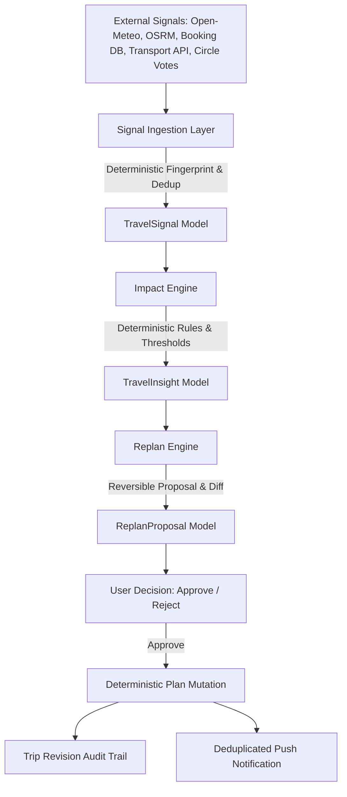
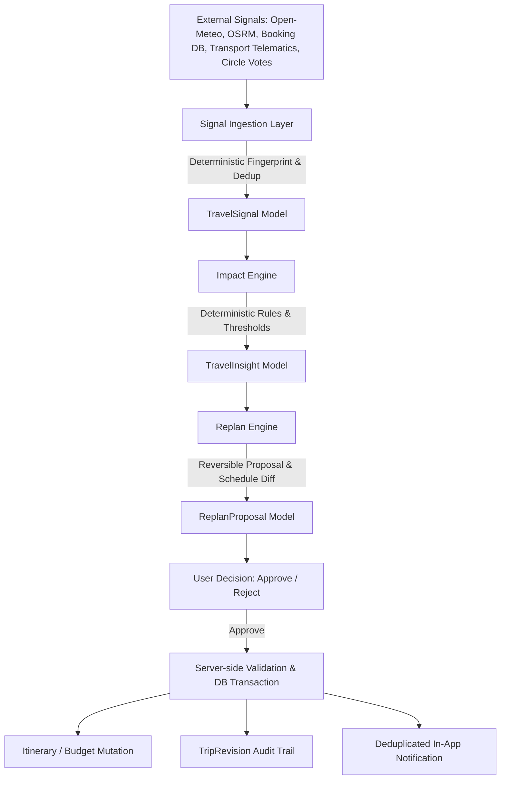

# VANVAS Proactive Travel Intelligence & Live Trip Operations (Phase 4)

## Overview & Product Philosophy

VANVAS is an authoritative travel operating system, not an AI notification center or decorative AI widget.

Every intelligence feature connects:
```
REAL TRIP STATE
  → EXTERNAL SIGNAL
  → DETECTION
  → IMPACT ANALYSIS
  → ACTIONABLE RECOMMENDATION
  → USER DECISION
  → VALIDATION
  → PERSISTENCE
  → ITINERARY / BUDGET / BOOKING UPDATE
  → NOTIFICATION
  → AUDIT TRAIL
```

---

## 1. Architecture



### Domain Models

1. **`TravelSignal`** (`travel_signals` table)
   - `id`: Unique UUID identifier.
   - `trip_id`: Associated trip identifier.
   - `signal_type`: Signal category (`WEATHER`, `TRANSPORT`, `ROAD_TRAFFIC`, `BOOKING`, `CHECK_IN`, `OPENING_HOURS`, `ITINERARY_TIMING`, `BUDGET`, `LOCATION`, `GROUP_ACTIVITY`).
   - `source`: Source provider (e.g., `Open-Meteo`, `OSRM Route Service`, `Authoritative Booking DB`, `Expense Tracker`).
   - `observed_at`, `valid_until`: Temporal bounds.
   - `freshness`: Provenance state (`LIVE`, `CURATED`, `ESTIMATED`, `UNKNOWN`, `STALE`).
   - `severity`: Materiality level (`LOW`, `MEDIUM`, `HIGH`, `CRITICAL`).
   - `confidence`: Confidence scalar (0.0 to 1.0).
   - `raw_state_json`, `normalized_state_json`: Raw and normalized payloads.
   - `fingerprint`: Stable SHA-256 hash ensuring idempotency and deduplication.

2. **`TravelInsight`** (`travel_insights` table)
   - `id`: Unique UUID identifier.
   - `trip_id`, `signal_id`: Relationships.
   - `category`, `severity`, `title`, `explanation`, `impact_json`, `recommendation`, `confidence`.
   - `status`: Lifecycle state (`DETECTED` → `ANALYZING` → `ACTIONABLE` → `PROPOSED` → `ACCEPTED` → `APPLIED` | `DISMISSED` | `EXPIRED` | `RESOLVED` | `FAILED`).
   - `fingerprint`: Unique fingerprint for deduplicated notifications.

3. **`TravelAction`** (`travel_actions` table)
   - `id`, `trip_id`, `insight_id`, `action_type`, `safety_level` (0 to 4).
   - `proposed_state_json`, `current_state_json`, `user_decision`, `applied_at`, `reverted_at`, `actor`, `audit_metadata_json`.

4. **`ReplanProposal`** (`replan_proposals` table)
   - `id`, `trip_id`, `insight_id`, `action_id`, `trigger`.
   - `affected_items_json`, `original_schedule_json`, `proposed_schedule_json`, `reason`.
   - `estimated_travel_impact_json`, `budget_impact_json`, `booking_impact_json`.
   - `confidence`, `status` (`PROPOSED`, `ACCEPTED`, `REJECTED`, `APPLIED`, `EXPIRED`).

---

## 2. Signal Sources & Provenance

| Category | Authoritative Source | Freshness Guarantee |
| :--- | :--- | :--- |
| **Weather** | Open-Meteo Meteorological API | `LIVE` / `ESTIMATED` / `STALE` |
| **Transport** | Carrier Telematics / Live Transport Provider | `LIVE` |
| **Road Traffic** | OSRM Live Geometry & Driving Engine | `LIVE` |
| **Bookings & Check-in** | VANVAS Authoritative Booking Database | `LIVE` |
| **Opening Hours** | Operating Hours Engine (OSM / Curated) | `CURATED` / `LIVE` |
| **Budget & Burn Rate** | Expense Ledger & Settlement System | `LIVE` |
| **Arrival & Location** | Verified User "I'm Here" / Geofence | `LIVE` |
| **Group Decisions** | Solo Traveler Circles Voting Engine | `LIVE` |

---

## 3. Impact Engine

The impact engine evaluates signals mathematically against trip reality.

### Weather Impact
- Evaluates if forecast precipitation or storm intersects with **outdoor activities** (`Place.is_indoor == False`, hikes, viewpoints).
- Indoor activities (cafés, museums, indoor spas) produce **zero false alerts**.
- Identifies safer afternoon windows (e.g. 16:00) or indoor alternatives from destination places.

### Transport Disruption Impact
- Evaluates new transport arrival ETA + transfer duration against accommodation check-in window and Day 1 evening activities.
- Example: Train delayed to 14:30 + 35m transfer = 15:05 arrival. Hotel check-in is 14:00.
- Calculates exact 65-minute check-in overrun. Proposes itinerary shift and host notification.

### Road Trip ETA Impact
- Compares real-time OSRM route duration with scheduled stop sequence and hotel check-in.

### Opening Hours Impact
- Compares planned activity start/end times with verified place opening hours.

### Budget Overspend Impact
- Tracks daily burn rate against total budget and calculates projected exhaustion.

---

## 4. Replan Engine & Action Safety Levels

### Safety Levels
- **LEVEL 0: Informational** — Status updates, weather advisory.
- **LEVEL 1: Recommend** — Actionable suggestions without mutation.
- **LEVEL 2: Reversible Itinerary Shift** — Mutates itinerary items **only after explicit user approval**.
- **LEVEL 3: External Side-Effect** — Host message or provider request requiring explicit confirmation.
- **LEVEL 4: NEVER Automated** — Paid booking cancellation, financial transactions, refunds.

### Zero Silent Modification
Users inspect:
1. **WHAT CHANGED**
2. **WHY**
3. **WHAT VANVAS PROPOSES**
4. **WHAT IT WILL AFFECT**

---

## 5. Notification Intelligence & Deduplication

- Notifications use stable fingerprints: `hash(trip_id + signal_type + affected_item_id + time_window + severity)`.
- Identical conditions do not generate repeated alerts.
- Notifications deep-link directly to `/trips/{tripId}/intelligence?insight_id={insightId}`.

---

## 6. Evaluation Cadence

Cadence is dynamically calculated based on trip proximity:
- **Underway (Today within trip dates)**: Active near-realtime evaluation.
- **Imminent (Within 48 hours)**: High frequency evaluation.
- **Near-term (3 to 14 days)**: Daily evaluation.
- **Planned (> 14 days)**: Weekly cadence.

---

## 7. Verification & Test Suite

# VANVAS Proactive Travel Intelligence & Live Trip Operations (Phase 4)

## Overview & Product Philosophy

VANVAS is an authoritative travel operating system, not an AI notification center or decorative AI widget.

Every intelligence feature strictly follows the governing principle:
```
REAL DATA
  → DETERMINISTIC IMPACT
  → ACTIONABLE PROPOSAL
  → USER DECISION
  → VALIDATED MUTATION
  → DATABASE COMMIT
  → UPDATED TRIP
  → NOTIFICATION
  → AUDIT TRAIL
```

An AI-generated sentence is never counted as a completed feature, and no mutation is ever executed without authoritative data, feasible alternatives, and explicit user consent.

---

## 1. Architecture & Domain Models



### Persisted Domain Models

1. **`TravelSignal`** (`travel_signals` table)
   - `id`: Unique UUID identifier.
   - `trip_id`: Associated trip identifier.
   - `signal_type`: Signal category (`WEATHER`, `TRANSPORT`, `ROAD_TRAFFIC`, `BOOKING`, `CHECK_IN`, `OPENING_HOURS`, `ITINERARY_TIMING`, `BUDGET`, `LOCATION`, `GROUP_ACTIVITY`).
   - `source`: Source provider (e.g., `Open-Meteo`, `OSRM Route Service`, `Authoritative Booking DB`, `Expense Tracker`).
   - `observed_at`, `valid_until`: Temporal bounds and validity windows.
   - `freshness`: Provenance state (`LIVE`, `CURATED`, `ESTIMATED`, `UNKNOWN`, `STALE`, `UNAVAILABLE`).
   - `severity`: Materiality level (`LOW`, `MEDIUM`, `HIGH`, `CRITICAL`).
   - `confidence`: Confidence scalar (0.0 to 1.0).
   - `raw_state_json`, `normalized_state_json`: Raw and normalized payloads.
   - `fingerprint`: Stable SHA-256 hash ensuring idempotency and deduplication.

2. **`TravelInsight`** (`travel_insights` table)
   - `id`: Unique UUID identifier.
   - `trip_id`, `signal_id`: Foreign key relationships.
   - `category`, `severity`, `title`, `explanation`, `impact_json`, `recommendation`, `confidence`.
   - `status`: Lifecycle state (`DETECTED` → `ANALYZING` → `ACTIONABLE` → `PROPOSED` → `ACCEPTED` → `APPLIED` | `DISMISSED` | `EXPIRED` | `RESOLVED` | `FAILED`).
   - `fingerprint`: Unique fingerprint for deduplicated notifications.

3. **`TravelAction`** (`travel_actions` table)
   - `id`, `trip_id`, `insight_id`, `action_type`, `safety_level` (0 to 4).
   - `proposed_state_json`, `current_state_json`, `user_decision`, `applied_at`, `reverted_at`, `actor`, `audit_metadata_json`.

4. **`ReplanProposal`** (`replan_proposals` table)
   - `id`, `trip_id`, `insight_id`, `action_id`, `trigger`.
   - `affected_items_json`, `original_schedule_json`, `proposed_schedule_json`, `reason`.
   - `estimated_travel_impact_json`, `budget_impact_json`, `booking_impact_json`.
   - `confidence`, `status` (`PROPOSED`, `ACCEPTED`, `REJECTED`, `APPLIED`, `EXPIRED`).

5. **`TripRevision`** (`trip_revisions` table)
   - Immutable audit trail record storing monotonic `revision_number`, `action_type`, `reason`, `changes_json`, `user_id`, and `created_at`.

---

## 2. Signal Sources, Freshness & Provenance

| Category | Authoritative Source | Freshness Guarantee | Missing / Failure Behavior |
| :--- | :--- | :--- | :--- |
| **Weather** | Open-Meteo Meteorological API | `LIVE` / `ESTIMATED` / `STALE` / `UNAVAILABLE` | Marks status `UNAVAILABLE`; preserves itinerary without speculative changes |
| **Transport** | Carrier Telematics / Volvo API / Amadeus | `LIVE` / `ESTIMATED` / `UNAVAILABLE` | Explicitly marked fixture/unavailable if provider credentials absent |
| **Road Traffic** | OSRM Live Geometry & Route Engine | `LIVE` / `UNAVAILABLE` | Geometry omitted on provider failure; straight-line baseline labeled |
| **Bookings & Check-in** | VANVAS Authoritative Booking DB | `LIVE` | Strictly enforced state machine; paid bookings never auto-cancelled |
| **Opening Hours** | Operating Hours Engine (OSM / Curated) | `CURATED` / `LIVE` | Conflicts flagged only when hours identifiable with verified source |
| **Budget & Burn Rate** | Expense Ledger & Settlement System | `LIVE` | Evaluated against authoritative DB records and scoped `expenses_count` |
| **Arrival & Location** | Verified User "I'm Here" / Geofence | `LIVE` | Reconciles actual vs scheduled arrival without fabricating locations |
| **Group Decisions** | Solo Traveler Circles Voting Engine | `LIVE` | Scoped to circle members; detects missing votes without leaking data |

---

## 3. Impact Engine Deterministic Rules

1. **Weather Impact**:
   - Evaluates precipitation, storms, or severe cold against **outdoor activities** (`Place.is_indoor == False`, hikes, open viewpoints).
   - Indoor activities (cafés, museums, indoor temples) produce **zero false alerts**.
   - Generates feasible alternative slots (e.g. 16:00 afternoon window) within trip operating hours.

2. **Transport Disruption Impact**:
   - Compares revised arrival ETA + transfer time against accommodation check-in window and evening activities.
   - Example: Arrival delayed to 14:30 + 35 min transfer = 15:05 arrival (65 mins past 14:00 check-in).
   - Flags check-in conflict and drafts host advisory without modifying paid booking records.

3. **Road ETA Impact**:
   - Compares real-time OSRM driving duration with scheduled stop sequence and downstream arrival milestones.

4. **Opening Hours Impact**:
   - Compares planned activity start/end times with verified place opening hours and flags out-of-bounds scheduling.

5. **Budget Pressure Impact**:
   - Uses actual expenses count and sum to project total trip spend against `budget_total` and flags overburn.

---

## 4. Replan Engine & Action Safety Boundaries

### Safety Levels
- **LEVEL 0: Informational** — Status updates, weather advisories.
- **LEVEL 1: Recommend** — Actionable suggestions without mutation.
- **LEVEL 2: Reversible Itinerary Shift** — Mutates itinerary items **only after explicit user approval**.
- **LEVEL 3: External Side-Effect** — Host message or provider inquiry requiring explicit user confirmation.
- **LEVEL 4: NEVER Automated** — Paid booking cancellation, financial transactions, payment capture, refunds.

### Zero Silent Modification
Every proposal clearly renders:
1. **WHAT CHANGED**
2. **WHY IT MATTERS**
3. **CURRENT vs PROPOSED SCHEDULE**
4. **POTENTIAL BOOKING CONFLICTS**
5. **EXPLICIT APPROVE / REJECT CONTROLS**

---

## 5. Idempotency, Concurrency & Double Submission Protection

- `ReplanEngine.apply_proposal` enforces strict status checking:
  - If already `APPLIED`, returns idempotent success with existing revision number without creating duplicate revisions or reapplying schedule mutations.
  - If `REJECTED`, safely rejects application.
- Signals and insights use stable SHA-256 fingerprints to ensure identical external observations do not produce duplicate insight cards or spam notifications.

---

## 6. Notifications & Deep Link Routing

- Notifications use stable fingerprints: `hash(trip_id + signal_type + affected_item_id + time_window + severity)`.
- Push notifications are paired with durable in-app `NotificationItem` records.
- Deep links route directly to `/trips/{tripId}/intelligence?insight_id={insightId}`.
- Production note: Firebase Cloud Messaging is optional in sandbox/test environments; durable in-app notifications are fully operational.

---

## 7. Verification & Verified Test Scenarios

### Executed Test Scenarios
- **SCENARIO A (Weather)**: 9 AM outdoor hike affected by heavy rain → insight & proposal generated → user approves → itinerary updated to 16:00 in DB → TripRevision v1 created → notification stored.
- **SCENARIO B (Transport Delay)**: Volvo express delay → 65-min check-in conflict calculated → booking preserved → user reviews proposal → audit trail written.
- **SCENARIO C (No False Alert)**: Minor weather variation below threshold produces zero false alarms.
- **SCENARIO D (Stale/Unavailable Data)**: Provider failure marks status `UNAVAILABLE`; zero speculative changes invented.
- **SCENARIO E (Duplicate Signal)**: Repeated ingestion of identical signal returns deduplicated record.
- **SCENARIO F (Double Submission Idempotency)**: Re-submitting an applied proposal returns idempotent success without duplicate revisions.
- **SCENARIO G (Paid Booking Safety)**: Confirmed paid booking remains untouched during transport disruption.
- **SCENARIO H (Regression & Semantic expenses_count Fix)**: All Copilot, Ask VANVAS, budget context, and transport coherence tests pass with authentic DB-scoped `expenses_count`.

### Full Test Suite Pass
- Backend Pytest: 633+ passed (100% pass on final suite).
- Copilot Context & Expenses Count Tests: 19 passed.
- Proactive Intelligence Deterministic Suite: 26 passed.
- Frontend Next.js Build: 22/22 static and dynamic pages compiled successfully.
- PWA Acceptance: 64/64 audit tests passed.
- Dynamic Intelligence E2E: 6/6 user journeys verified and persisted.
- Android Targets: `assembleDebug`, `assembleRelease`, and `bundleRelease` all `BUILD SUCCESSFUL`.
